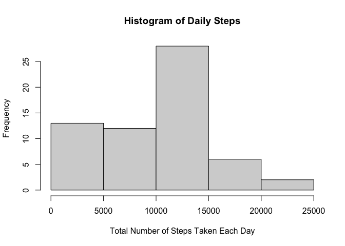
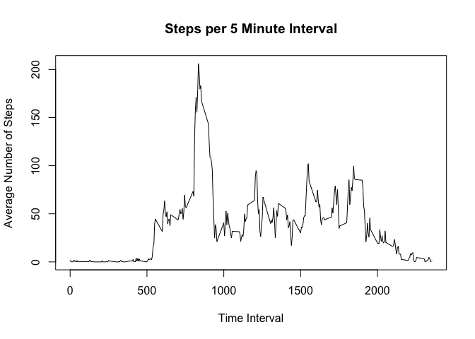
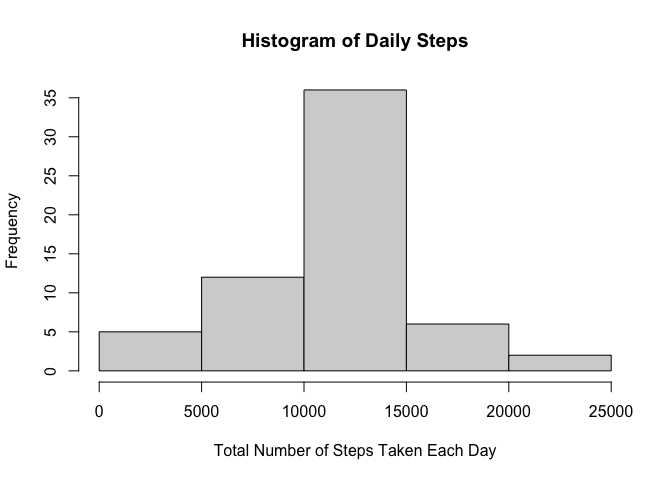
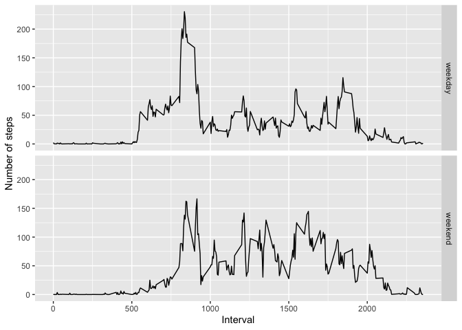

# Reproducible Research - Course Project 1

## Loading and Preprocessing the Data

    unzip(zipfile = "activity.zip")
    activity <- read.csv("activity.csv")

## What is mean total number of steps taken per day?

    library(dplyr)

    ## 
    ## Attaching package: 'dplyr'

    ## The following objects are masked from 'package:stats':
    ## 
    ##     filter, lag

    ## The following objects are masked from 'package:base':
    ## 
    ##     intersect, setdiff, setequal, union

    total_steps <- activity %>% group_by(date) %>% summarize(daily_steps = sum(steps, na.rm = TRUE))

    hist(total_steps$daily_steps, main = "Histogram of Daily Steps", xlab="Total Number of Steps Taken Each Day")

 Calculate the
mean:

    mean(total_steps$daily_steps, na.rm = TRUE)

    ## [1] 9354.23

Calculate the median:

    median(total_steps$daily_steps, na.rm = TRUE)

    ## [1] 10395

## What is the average daily activity pattern?

    steps_interval <- activity %>% group_by(interval) %>% summarize(interval_steps = mean(steps, na.rm = TRUE))

    plot(steps_interval$interval_steps ~ steps_interval$interval, type="l", xlab = "Time Interval", ylab = "Average Number of Steps", main = "Steps per 5 Minute Interval")

 Which
5-minute interval, on average across all the days in the dataset,
contains the maximum number of steps?

    max_interval <- steps_interval$interval[which.max(steps_interval$interval_steps)]
    max_steps <- max(steps_interval$interval_steps)

    paste("Max interval:", max_interval," Number of steps:", max_steps)

    ## [1] "Max interval: 835  Number of steps: 206.169811320755"

## Imputing missing values

1.  Calculate and report the total number of missing values in the
    dataset (i.e. the total number of rows with NAs)

<!-- -->

    sum(is.na(activity$steps))

    ## [1] 2304

1.  Devise a strategy for filling in all of the missing values in the
    dataset. The strategy does not need to be sophisticated. For
    example, you could use the mean/median for that day, or the mean for
    that 5-minute interval, etc.

Strategy used was to fill in the mean steps for that day for each 5
minute interval, as calculated previously.

1.  Create a new dataset that is equal to the original dataset but with
    the missing data filled in.

<!-- -->

    activity_impute <- activity  
    for (i in 1:nrow(activity)){
            if(is.na(activity$steps[i])){ #Checks for NA.
                    activity_impute$steps[i] <- steps_interval$interval_steps[activity_impute$interval[i] == steps_interval$interval]
            }
    }

This code made use of activity and steps\_interval to form the new
dataset.

1.  Make a histogram of the total number of steps taken each day and
    Calculate and report the mean and median total number of steps taken
    per day. Do these values differ from the estimates from the first
    part of the assignment? What is the impact of imputing missing data
    on the estimates of the total daily number of steps?

<!-- -->

    total_steps <- activity_impute %>% group_by(date) %>% summarize(daily_steps = sum(steps, na.rm = TRUE))

    hist(total_steps$daily_steps, main = "Histogram of Daily Steps", xlab="Total Number of Steps Taken Each Day")

 Note the
difference in distribution in comparison to the earlier histogram with
NAs removed, rather than imputed.

Calculate the mean:

    mean(total_steps$daily_steps, na.rm = TRUE)

    ## [1] 10766.19

Calculate the median:

    median(total_steps$daily_steps, na.rm = TRUE)

    ## [1] 10766.19

Both the new mean and median are higher than the old mean and median.

## Are there differences in activity patterns between weekdays and weekends?

1.  Create a new factor variable in the dataset with two levels –
    “weekday” and “weekend” indicating whether a given date is a weekday
    or weekend day.

<!-- -->

    activity_impute$date <- as.Date(activity_impute$date)
    activity_impute$day <- ifelse(weekdays(activity_impute$date) %in% c("Saturday", "Sunday"), "weekend", "weekday")
    activity_impute$day <- as.factor(activity_impute$day)

1.  Make a panel plot containing a time series plot (i.e. type = “l”) of
    the 5-minute interval (x-axis) and the average number of steps
    taken, averaged across all weekday days or weekend days (y-axis).

<!-- -->

    library(ggplot2)
    average_steps <- aggregate(steps ~ interval + day, data=activity_impute, FUN='mean')
    g <- ggplot(average_steps, aes(interval, steps)) +
         geom_line() +
         facet_grid(day ~ .) +
         xlab("Interval") + ylab("Number of steps")
    g

Based on the graph, weekdays have higher peak number of steps in
comparison to weekends. However, the peaks during weekends have more
even distribution than weekdays.
